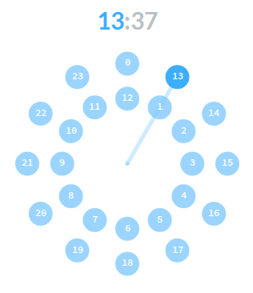

# react-timepicker
`Timepicker` is a [React]() timepicker component that looks like Android KitKat one.

### [Demo][]


### Dependencies

* [React][]

### How To
Using [npm][]

```sh
npm install react-timepicker
```

Using [Meteor][]

```sh
meteor add universe:react-clock-picker
```

### Usage
```js
// Remember to include timepicker.css
<Timepicker {...timepickerOptions} />
```

### Options
```js
// Everything is optional.
var timepickerOptions = {
    mode: Timepicker.MODE_HOURS, // or Timepicker.MODE_MINUTES

    size:   300,
    radius: 125,

    hours:   0,
    minutes: 0,

    militaryTime: true // 24 hours if true, 12 otherwise

    onChange: function (hours, minutes) {},
    onChangeMode: function (mode) {}
};
```

[npm]:    https://npmjs.org/
[React]:  https://facebook.github.io/react/
[Meteor]: https://www.meteor.com/

[Demo]: https://jsfiddle.net/radekm/o7syg3q9/embedded/result/
